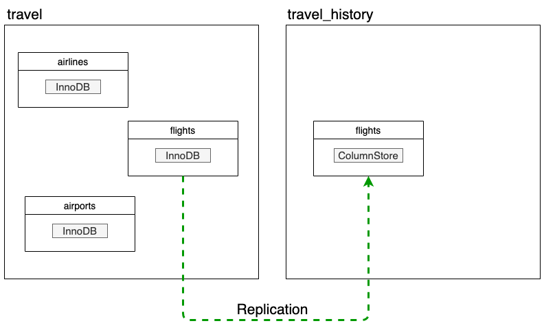

# MariaDB SkySQL HTAP Quick Start

[MariaDB SkySQL](https://mariadb.com/products/skysql/docs/) is the best database-as-a-service (DBaaS) available today. It’s the first DBaaS to support OLTP, OLAP and hybrid workloads, storing data both in row format on persistent block storage and columnar format on object storage. 

**The following is a walkthrough to get you up and running with a MariaDB SkySQL [Hybrid Transactional/Analytical Processing (HTAP)](https://mariadb.com/docs/solutions/htap/) database instance in less than 15 minutes.** No, seriously. Alright, let's get started!

And, if you haven't yet - [sign up for MariaDB SkySQL](https://mariadb.com/products/skysql/get-started/). We're currently offering $500 credit which is a lot of runway depending on how you set up your instances. 

## Prerequisites 

Before getting started with this walkthrough you will need to:

1. [Install the latest, stable MariaDB client](https://mariadb.com/products/skysql/docs/clients/mariadb-client-for-skysql-services/#mariadb-client-for-skysql-services).

2. [Launch a SkySQL Smart Transaction (HTAP) instance](https://mariadb.com/products/skysql/docs/operations/provision/#skysql-launch-smart).

3. Clone this repository.

```
$ git clone https://github.com/mariadb-corporation/dev-example-skysql-htap-quickstart.git
```

## Overview

This walk-through will investigate the following:

* Setting up an existing database instance
    * Connect to your MariaDB SkySQL HTAP instance
    * Create the schema
    * Enable HTAP replication
    * Replace a replicated InnoDB table with a ColumnStore table
    * Load data into the tables
* Introduction to cross-engine querying
* Testing table-to-table replication

## Setting up HTAP in MariaDB SkySQL

The proceeding walk-through will result in the following setup:

- [travel](schema/idb_schema.sql#L1) (database)
    - [airlines](schema/idb_schema.sql#L5) (InnoDB table): 30 rows
    - [airports](schema/idb_schema.sql#L11) (InnoDB table): 342
    - [flights](schema/idb_schema.sql#L21) (InnoDB table): 0 rows
- [travel_history](schema/cs_schema.sql#L1) (database)
    - [flights](schema/cs_schema.sql#L5) (ColumnStore table): 679996 rows

<p align="center" spacing="10">
    <kbd>
        
    </kbd>
</p> 

In the next section, the following steps will walk you through the process for setting up HTAP (with replication) on MariaDB SkySQL. 

For more details on this process please refer to the [official SkySQL documentation](https://mariadb.com/products/skysql/docs/operations/htap-replication/).

### SkySQL HTAP Setup Steps 

1.) Download the HTAP instance's Certificate authority chain from SkySQL, and place in the root of this project.

<p align="center" spacing="10">
    <kbd>
        
    </kbd>
</p>

<p align="center" spacing="10">
    <kbd>
        
    </kbd>
</p>

2.) Open a terminal window and then, using the `mariadb` client within the root folder of this repository, connect to your MariaDB SkySQL HTAP service and create the schema:

```bash
$ mariadb --host <host_address> --port <port_number> --user <user_name> -p<password> --ssl-ca skysql_chain.pem < create_schema.sql
```

For example: 
```bash
$ mariadb --host htap-instance.mdb0001500.db.skysql.net --port 5001 --user DB00009999 -p'Password123!' --ssl-ca skysql_chain.pem < create_schema.sql
```

3.) Using the terminal, execute the following command to enable HTAP replication.

```bash
$ mariadb --host <host_address> --port <port_number> --user <user_name> -p<password> --ssl-ca skysql_chain.pem < enable_replication.sql
```

To confirm that replication has been setup you can use the `SHOW_HTAP_REPLICATION()` function within a SQL statement:

```sql 
SELECT SHOW_HTAP_REPLICATION();
```

Which should yield the following results:

```sql
+-----------------------------------------------------------------------------------------------------------------+
| show_htap_replication()                                                   |
+-----------------------------------------------------------------------------------------------------------------+
| 
	=== replication_filter ===
	table: travel.flights
	source database: travel
	target database: travel_history

 |
+-----------------------------------------------------------------------------------------------------------------+
```

4.) Using the terminal, execute the following command to replace InnoDB `flights` table in the `travel_history` database with a ColumnStore table.

```bash
$ mariadb --host <host_address> --port <port_number> --user <user_name> -p<password> --ssl-ca skysql_chain.pem < add_columnstore.sql
```

5.) Finally, execute the following command to load the `travel.airports`, `travel.airlines`, and `travel_history.flights` tables.

```
$ ./load.sh <host_address> <port_number> <user> <password>
```

for example

```
./load.sh htap-instance.mdb0001500.db.skysql.net 5001 DB00009999 *******
```

**Note:** Remember to wrap argument values in single quotes if they contain special characters (e.g. !)

For more information on loading data into SkySQL databases be sure to check out the [official documentation](https://mariadb.com/products/skysql/docs/operations/data-loading/)!

## The Power of HTAP

### Introduction to cross-engine querying

Cross-engine querying, or joining, allows you to query both transactional and analytical information in a single query. Execute the following sample queries to get a first-hand view of the power of cross-engine querying.

**Get the number of flights for each airline**

```sql
SELECT 
    a.airline,
    COUNT(*)
FROM
    travel.airlines a INNER JOIN
    travel_history.flights f ON a.iata_code = f.carrier
GROUP BY
    a.airline
```

**Get the top ten airports with the lowest average departure delays**

```sql
SELECT 
    a.airline, 
    AVG(dep_delay) 
FROM 
    travel.airlines a INNER JOIN 
travel_history.flights f ON a.iata_code = f.origin 
GROUP BY
    a.airline 
ORDER BY
    AVG(dep_delay) 
LIMIT 10;
```

### Testing table-to-table replication

When using MariaDB Platform for Smart Transactions, data can be replicated from InnoDB tables to ColumnStore tables, which we've already enabled. So, let's test it out!

1. Insert a new flight record into `travel.flights`.

```sql
INSERT INTO travel.flights VALUES(2020,4,3,1,'2020-04-03','DL','N9999A',100,'ORD','LAX','0600','0600',0);
```

2. Confirm that the record has been inserted `travel.flights` and replicated to `travel_history.flights` by comparing the following results.

```sql
SELECT * FROM travel.flights WHERE fl_date = '2020-04-03' AND tail_num = 'N9999A';
```

```sql
SELECT * FROM travel_history.flights WHERE fl_date = '2020-04-03' AND tail_num = 'N9999A';
```

For more information on managing SkySQL HTAP replication be sure to check out the [official documentation](https://mariadb.com/products/skysql/docs/operations/htap-replication/)!

## More resources

- [Sign up for MariaDB SkySQL](https://mariadb.com/products/skysql/get-started/)
- [Official MariaDB SkySQL Documentation](https://mariadb.com/products/skysql/docs/)
