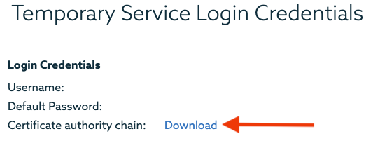
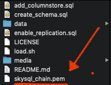

# MariaDB SkySQL HTAP Quick Start

[MariaDB SkySQL](https://mariadb.com/products/skysql/docs/) is the best database-as-a-service (DBaaS) available today. It’s the first DBaaS to support OLTP, OLAP and hybrid workloads, storing data both in row format on persistent block storage and columnar format on object storage. 

**The following is a walkthrough to get you up and running with a MariaDB SkySQL [Hybrid Transactional/Analytical Processing (HTAP)](https://mariadb.com/docs/solutions/htap/) database instance in less than 15 minutes.** No, seriously. Alright, let's get started!

And, if you haven't yet - [sign up for MariaDB SkySQL](https://mariadb.com/products/skysql/get-started/). We're currently offering $500 credit which is a lot of runway depending on how you set up your instances. TL;DR it's free for developers wanting to check it out.

## Prerequisites 

Before getting started with this walkthrough you will need to:

1. [Install the latest, stable MariaDB client](https://downloads.mariadb.org/).

2. [Launch a SkySQL Smart Transaction (HTAP) instance](https://mariadb.com/products/skysql/docs/operations/provision/#skysql-launch-smart).

3. Clone this repository.

```
$ git clone https://github.com/rhedgpeth/skysql_htap_demo.git
```

## Overview

This walk-through will investigate the following:

* Setting up an existing database instance
    * Connect to your MariaDB SkySQL HTAP instance
    * Create the schema and load the tables
    * Enable replication
* Introduction to cross-engine querying
* Testing table-to-table replication

## Set up the database instance

The following steps will 

1. Download the HTAP instance's Certificate authority chain from SkySQL, and place in the root of this project.

<p align="center" spacing="10">
    <kbd>
        
    </kbd>
</p>

<p align="center" spacing="10">
    <kbd>
        
    </kbd>
</p>

2. Execute the following command with your database instance information.

```
$ ./create_and_load.sh <host_address> <port_number> <user> <password>
```

for example

```
./create_and_load.sh sky0001355.mdb0001390.db.skysql.net 5001 DB00009999 *******
```

For more information on loading data into SkySQL databases be sure to check out the [official documentation](https://mariadb.com/products/skysql/docs/operations/data-loading/)!

3.) Execute the following command on your MariaDB SkySQL database instance to set up replication.

```
SELECT SET_HTAP_REPLICATION('flights','travel','travel_history');
```

That's it! The following will be created, loaded, and configured to replicate (travel.flights -> travel_history.flights).

- [travel](schema/idb_schema.sql#L1) (database)
    - [airlines](schema/idb_schema.sql#L5) (InnoDB table): 17 rows
    - [airports](schema/idb_schema.sql#L11) (InnoDB table): 342
    - [flights](schema/idb_schema.sql#L21) (InnoDB table): 0 rows
- [travel_history](schema/cs_schema.sql#L1) (database)
    - [flights](schema/cs_schema.sql#L5) (ColumnStore table): 679996 rows

## The Power of HTAP

### Introduction to cross-engine querying

Cross-engine querying, or joining, allows you to query both transactional and analytical information in a single query. Execute the following sample queries to get a first-hand view of the power of cross-engine querying.

**Get the number of flights for each airline**

```sql
SELECT 
    a.airport,
    COUNT(*)
FROM
    travel.airlines a INNER JOIN
    travel_history.flights f ON a.iata_code = f.carrier
GROUP BY
    a.airline
```

**Get the top ten airports with the lowest average departure delays**

```sql
SELECT 
    a.airport, 
    AVG(dep_delay) 
FROM 
    travel.airports a INNER JOIN 
travel_history.flights f ON a.iata_code = f.origin 
GROUP BY
    a.airport 
ORDER BY
    AVG(dep_delay) 
LIMIT 10;
```

### Testing table-to-table replication

When using MariaDB Platform for Smart Transactions, data can be replicated from InnoDB tables to ColumnStore tables, which we've already enabled. So, let's test it out!

1. Insert a new flight record into `travel.flights`.

```sql
INSERT INTO travel.flights VALUES(2020,4,3,1,'2020-04-03','DL','N9999A',100,'ORD','LAX','0600','0600',0);
```

2. Confirm that the record has been inserted `travel.flights` and replicated to `travel_history.flights` by comparing the following results.

```sql
SELECT * FROM travel.flights WHERE fl_date = '2020-04-03' AND tail_num = 'N9999A';
```

```sql
SELECT * FROM travel_history.flights WHERE fl_date = '2020-04-03' AND tail_num = 'N9999A';
```

For more information on managing SkySQL HTAP replication be sure to check out the [official documentation](https://mariadb.com/products/skysql/docs/operations/htap-replication/)!

## More resources

- [Sign up for MariaDB SkySQL](https://mariadb.com/products/skysql/get-started/)
- [Official MariaDB SkySQL Documentation](https://mariadb.com/products/skysql/docs/)
